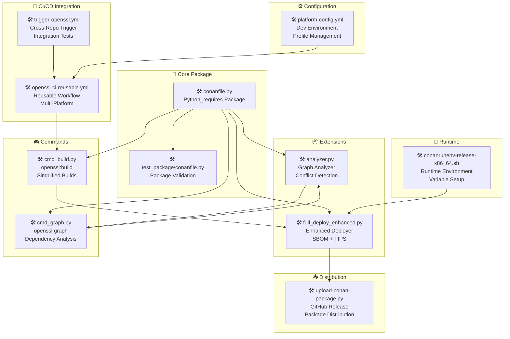
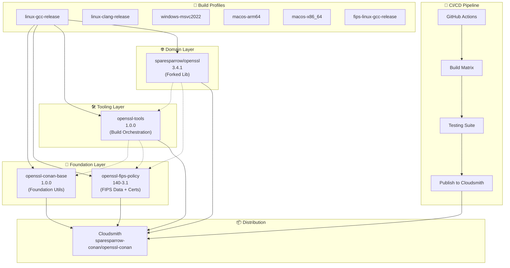

# OpenSSL CI/CD Modernization - Architecture Diagram

## 🏗️ Corrected Architecture

## Key Components

### Foundation Layer
- **openssl-conan-base**: Core utilities, profiles, and Python environment
- **openssl-fips-policy**: FIPS 140-3 certificates and compliance data

### Tooling Layer
- **openssl-tools**: Build orchestration, automation scripts, and infrastructure

### Domain Layer
- **sparesparrow/openssl**: Forked OpenSSL library with Conan integration

### Distribution
- **Cloudsmith**: Package repository for all OpenSSL components

### Build Profiles
- **6 Standard Profiles**: Cross-platform support for Linux, Windows, macOS
- **FIPS Compliance**: Specialized profile for FIPS 140-3 requirements

### CI/CD Pipeline
- **GitHub Actions**: Automated build, test, and publish workflows
- **Build Matrix**: Multi-platform testing and validation
- **Security**: SBOM generation and compliance checking

