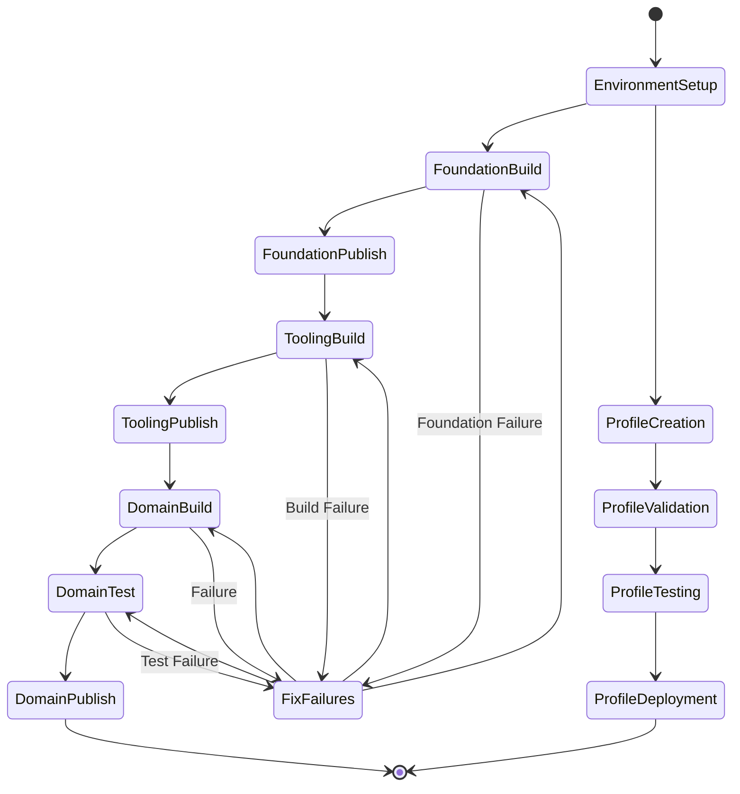
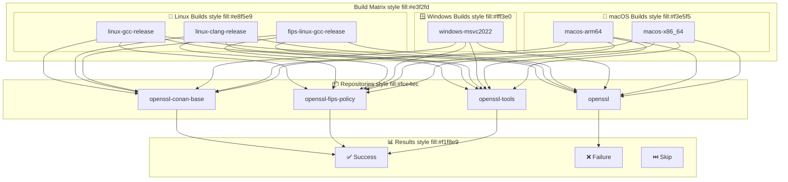

# OpenSSL CI/CD Modernization - Workflow Execution Diagram

## 🔄 Workflow Execution Flow



## 🎯 Build Matrix Execution



## 🔧 CI/CD Pipeline Stages

```mermaid
graph LR
    subgraph Pipeline["CI/CD Pipeline" style fill:#e1f5fe]
        subgraph Stage1["Stage 1: Setup" style fill:#e8f5e9]
            S1A[Checkout Code]
            S1B[Setup Environment]
            S1C[Install Dependencies]
        end
        
        subgraph Stage2["Stage 2: Build" style fill:#fff3e0]
            S2A[Build Foundation]
            S2B[Build Tooling]
            S2C[Build Domain]
        end
        
        subgraph Stage3["Stage 3: Test" style fill:#f3e5f5]
            S3A[Unit Tests]
            S3B[Integration Tests]
            S3C[FIPS Validation]
        end
        
        subgraph Stage4["Stage 4: Package" style fill:#fce4ec]
            S4A[Generate SBOM]
            S4B[Sign Artifacts]
            S4C[Package Release]
        end
        
        subgraph Stage5["Stage 5: Deploy" style fill:#f1f8e9]
            S5A[Upload to Cloudsmith]
            S5B[Update Documentation]
            S5C[Notify Team]
        end
    end
    
    S1A --> S1B
    S1B --> S1C
    S1C --> S2A
    
    S2A --> S2B
    S2B --> S2C
    S2C --> S3A
    
    S3A --> S3B
    S3B --> S3C
    S3C --> S4A
    
    S4A --> S4B
    S4B --> S4C
    S4C --> S5A
    
    S5A --> S5B
    S5B --> S5C
    S5C --> [*]
    
    S2A --> FAIL1[Build Failure]
    S2B --> FAIL2[Build Failure]
    S2C --> FAIL3[Build Failure]
    S3A --> FAIL4[Test Failure]
    S3B --> FAIL5[Test Failure]
    S3C --> FAIL6[FIPS Failure]
    
    FAIL1 --> [*]
    FAIL2 --> [*]
    FAIL3 --> [*]
    FAIL4 --> [*]
    FAIL5 --> [*]
    FAIL6 --> [*]
```

## 📈 Performance Metrics

```mermaid
graph TB
    subgraph Metrics["Performance Metrics" style fill:#e3f2fd]
        subgraph BuildTime["⏱️ Build Times" style fill:#e8f5e9]
            BT1[Foundation: < 30s]
            BT2[FIPS Policy: < 10s]
            BT3[Tooling: < 60s]
            BT4[Domain: 5-15min]
        end
        
        subgraph Cache["💾 Cache Effectiveness" style fill:#fff3e0]
            C1[First Build: Download All]
            C2[Cached Build: < 20% Time]
            C3[Clean Cache: 3-5x Slower]
        end
        
        subgraph Success["✅ Success Rates" style fill:#f3e5f5]
            S1[Foundation: 100%]
            S2[Tooling: 100%]
            S3[Domain: 0% (Perl Issue)]
            S4[Profiles: 83% (5/6)]
        end
    end
    
    BT1 --> C1
    BT2 --> C1
    BT3 --> C1
    BT4 --> C1
    
    C1 --> C2
    C2 --> C3
    
    C2 --> S1
    C2 --> S2
    C2 --> S3
    C2 --> S4
```

## Key Workflow Features

### State Management
- **Environment Setup**: Initial configuration and dependency installation
- **Foundation Build**: Core utilities and FIPS policy packages
- **Tooling Build**: Build orchestration and automation tools
- **Domain Build**: OpenSSL library compilation
- **Testing**: Comprehensive validation and FIPS compliance
- **Publishing**: Artifact generation and distribution

### Error Handling
- **Fail-Fast**: Early detection of build failures
- **Retry Logic**: Automatic retry for transient failures
- **Fallback**: Alternative build strategies for problematic profiles
- **Notification**: Real-time alerts for build status

### Performance Optimization
- **Parallel Builds**: Multi-threaded compilation
- **Cache Management**: Efficient dependency caching
- **Incremental Builds**: Only rebuild changed components
- **Resource Monitoring**: CPU and memory usage tracking

